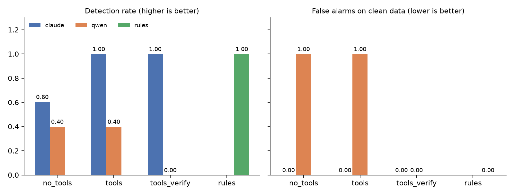
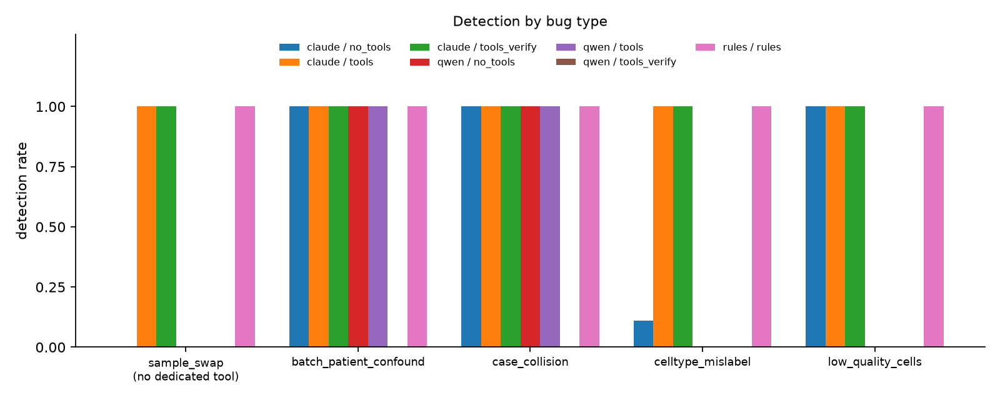

# Can a tool-using LLM agent catch silent errors in single-cell data?

**Question.** Single-cell datasets often carry silent metadata errors: swapped
sample labels, a batch column that is secretly the patient column, duplicate
columns whose names differ only by case. They don't crash anything; they just
make the analysis wrong. Can an LLM agent with QC tools find them, and does
forcing the agent to verify its own findings help?

**Short answer.** With tools, Claude found all 43 injected errors across 40
datasets with zero false alarms, up from 60% without tools. Every gain came
from errors that leave no trace in a metadata summary. Self-verification added
cost but no benefit for Claude. For an open-weight 7B model (Qwen2.5-7B),
verification removed false alarms only by suppressing every finding.

Each bug type is modeled on an error I hit in real analyses:

| Bug type | Real-life origin | Dedicated tool? |
|---|---|---|
| `sample_swap` | ~70% of a CAR-T sample mislabeled | **No** (must reason from `compare_groups`) |
| `batch_patient_confound` | batch column was a relabeling of patient | `check_label_consistency` |
| `case_collision` | `numericMeta.All` vs `numericMeta.ALL` | `find_case_collisions` |
| `celltype_mislabel` | cluster annotation error | `run_marker_check` |
| `low_quality_cells` | unfiltered damaged cells | `check_qc_metrics` |

## Setup

**Data.** pbmc3k (Scanpy), 2,638 PBMCs from one donor. Because it has no
patient/sample/batch structure, I add a synthetic study design: 6 patients ×
2 timepoints = 12 samples, processed in 3 batches that each mix 4 patients.
Sex-linked genes (XIST, RPS4Y1) are simulated per cell from the true patient's
sex so that sample swaps leave a biological trace, as they do in real data.

**Benchmark.** `scripts/make_benchmark.py` makes 40 corrupted copies
(10 clean, the rest with one or two bugs, bug types balanced: 43 injected bugs
in total) and an `answer_key.json`.

**Tools** (`qcagent/tools.py`). Six plain Python functions returning short text
(≤2,500 chars). They report facts and flags but never name a bug type.

**Conditions** (`qcagent/agent.py`):

1. `no_tools`: one call; the model sees only the `summarize_metadata()` text.
2. `tools`: agent loop with all six tools, max 15 steps.
3. `tools_verify`: condition 2, then a verification phase. **Rule, fixed before
   running:** the agent must re-check each suspected bug with ≥1 new tool call
   and mark it `confirmed` true/false. A bug is kept only if it is confirmed
   *and* the verification phase contained at least one tool call.

Every condition ends in the same JSON report, scored automatically against the
answer key. A non-LLM rule-based agent (`rules`) runs the same tools with fixed
thresholds as a reference for "is this bug detectable from the tool outputs at all?"

**Models.** Claude Sonnet 5.5 (`claude-sonnet-5-5`, via the Anthropic API, default
sampling) and Qwen2.5-7B-Instruct (local, via Ollama, temperature 0, 32k context).

**Metrics.** Detection rate, false-alarm rate on clean datasets, precision,
exact-match rate, unsupported-evidence rate (reported evidence citing numbers
that appear in no tool output the model received), tool calls and tokens per dataset.

## Predictions (committed before any LLM runs)

> _Condition 3 vs 2, false alarms:_ Fewer. Requiring a confirming tool call before a bug is reported should filter out guesses that the tool outputs don't support.
> **Outcome:** Partly right. Claude had zero false alarms in both conditions. Qwen's dropped from 100% to 0%, but only because it stopped reporting anything at all.

> _Condition 3 vs 2, detection:_ About the same. Verification can only remove findings, and I expect the model to rarely reverse a draft conclusion, so few real bugs should be dropped.
> **Outcome:** Right for Claude (100% in both). Wrong for Qwen: detection fell from 40% to 0% as verification discarded correct findings along with wrong ones.

> _Which bug type will be hardest, and why:_ `low_quality_cells`. Spotting damaged cells means judging QC thresholds across several metrics, and the clean data already contains 25 high-count outlier cells that could blur the line between a real problem and normal variation.
> **Outcome:** Wrong. Claude caught every damaged-cell bug even without tools, because extreme values show up in the column summary. The hardest were `sample_swap` (0/9 without tools) and `celltype_mislabel` (1/9), which change no column-level statistics.

## Results

A rule-based reference with hand-set thresholds detects 100% of bugs with 0 false
alarms, confirming every bug type is recoverable from the tool outputs. LLM
results should be read against this ceiling. On clean pbmc3k every tool reports
nothing abnormal; the only background signal is 25 high-count cells (possible
doublets) that `check_qc_metrics` lists as informational.

| Model | Condition | n | Detection | False alarms (clean) | Precision | Mean tool calls | Mean tokens |
|---|---|---|---|---|---|---|---|
| Claude | no_tools | 40 | 0.60 | 0.00 | 1.00 | 0 | 1.4k |
| Claude | tools | 40 | 1.00 | 0.00 | 1.00 | 6.5 | 8.4k |
| Claude | tools_verify | 40 | 1.00 | 0.00 | 1.00 | 8.4 | 16.9k |
| Qwen2.5-7B | no_tools | 8 | 0.40 | 1.00 | 0.25 | 0 | 0.8k |
| Qwen2.5-7B | tools | 8 | 0.40 | 1.00 | 0.25 | 21.3 | 78k |
| Qwen2.5-7B | tools_verify | 8 | 0.00 | 0.00 | 0.00 | 51.5 | 369k |

Qwen conditions are compared on the 8 datasets (4 clean) where all three
completed; 8 Qwen runs were excluded after local inference timeouts or server
errors. Full tables: `results/matched/summary.md`.




**Key findings**

1. **Tools matter for errors that leave no trace in a summary.** Without tools,
   Claude caught every summary-visible error (batch confound, case collision,
   damaged cells) but 0/9 sample swaps and 1/9 cell-type mislabels. With tools
   it caught all 43 injected bugs, including the sample swaps, which have no
   dedicated tool.
2. **Verification gave no benefit for Claude** (already at ceiling) and roughly
   doubled token cost.
3. **For Qwen, verification eliminated false alarms only by suppressing all
   findings.** Detection fell from 0.40 to 0.00, it hit the step cap in 7 of 8
   runs, and it discarded 2 correct findings along with 5 incorrect ones.

## Failure modes

From reading the runs in `results/matched/failures.md`:

- **Invisible to the summary (Claude, no_tools).** Every miss was a sample swap
  or cell-type mislabel, which change no column-level statistics. Expected
  behavior, not a reasoning error.
- **Faithful quotes, wrong conclusion (Qwen).** Evidence copied tool output
  verbatim ("Perfect one-to-one mapping: False. sample nested in patient: True")
  and then concluded batch-patient confounding, which the quoted text
  contradicts. The unsupported-numbers metric scores these as 0% hallucinated,
  which shows the limit of number-based hallucination checks.
- **Fixation on one hypothesis (Qwen).** Reported `batch_patient_confound` on
  every clean dataset in `no_tools` and `tools`.
- **Wrong tool arguments (Qwen).** Checked `sample` vs `patient` instead of
  `batch` vs `patient`, and rarely called the marker check.
- **Repetitive tool loops (Qwen).** Alternated the same two calls with identical
  arguments until the step cap.
- **Verification collapse (Qwen).** Under verification, looped without
  confirming any finding, dropping real bugs.

## Limitations

- Patient/sample/batch structure and sex-gene expression are simulated on a
  single-donor dataset. Next step: repeat on a real multi-donor dataset.
- Four of five bug types have a tool built to expose them, so high detection
  there partly measures tool design. `sample_swap` is the one type that
  requires the agent to combine evidence; results are reported per type.
- Injected bugs are cleaner than real ones (e.g. a perfect 1:1 batch/patient map).
- Qwen results rest on 8 matched datasets; per-bug-type Qwen numbers rest on
  one example each and should not be over-read.
- `check_label_consistency` reports Cramér's V, which is 1.0 for any nested pair
  (like sample within patient). That likely contributed to Qwen's misreading;
  a clearer tool output is an obvious next experiment.
- The unsupported-evidence metric only checks numbers, so it misses
  logically wrong reasoning built on correctly quoted values.
- One run per condition; no variance estimate (Claude is not run at temperature 0).
- Harness notes: Qwen ran with a 32k context, and a model that returned a
  completely empty reply was asked once more for its report (logged as
  `empty_nudges`; never triggered for Claude).

## Reproduce

```bash
pip install -r requirements.txt
pytest -q                                   # offline tests, synthetic data

python scripts/inspect_clean.py             # tool outputs on clean pbmc3k
python scripts/make_benchmark.py --n 40     # -> benchmark/ + answer_key.json

python scripts/run_experiment.py --models rules                 # free reference
export ANTHROPIC_API_KEY=...
python scripts/run_experiment.py --models claude --limit 3      # smoke test
ollama pull qwen2.5:7b-instruct
python scripts/run_experiment.py --models claude,qwen           # full run, resumable
python scripts/evaluate.py                                      # -> results/
python scripts/evaluate.py --matched --out results/matched      # same datasets per condition
```

No network? `--source synthetic` on `make_benchmark.py` builds an offline
stand-in with the same structure. Don't report its numbers as pbmc3k results.

## Layout

```
qcagent/data.py      clean data + synthetic study design
qcagent/tools.py     the six QC tools + JSON schemas
qcagent/bugs.py      bug injectors
qcagent/llm.py       Anthropic / Ollama clients, one interface
qcagent/agent.py     agent loop, 3 conditions, verification rule, rule-based reference
scripts/             make_benchmark, run_experiment, evaluate, inspect_clean
results/             run logs, metrics, figures, failure traces
tests/               offline tests (tools catch each bug; loop, verify, step cap, scoring)
```
